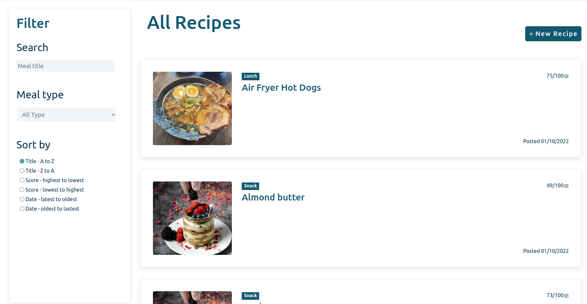
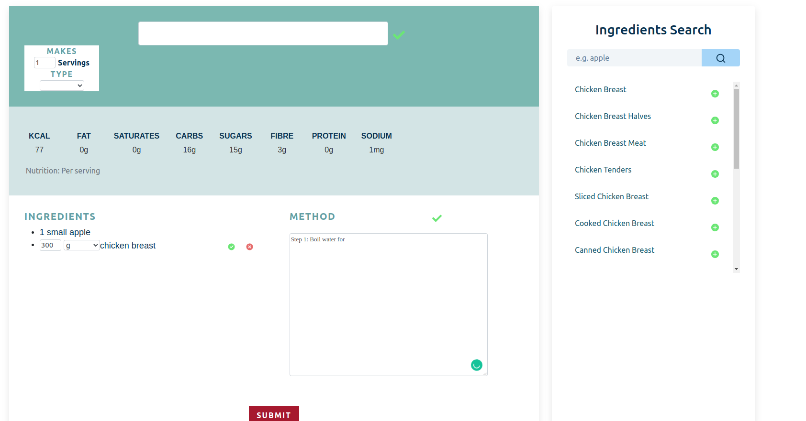
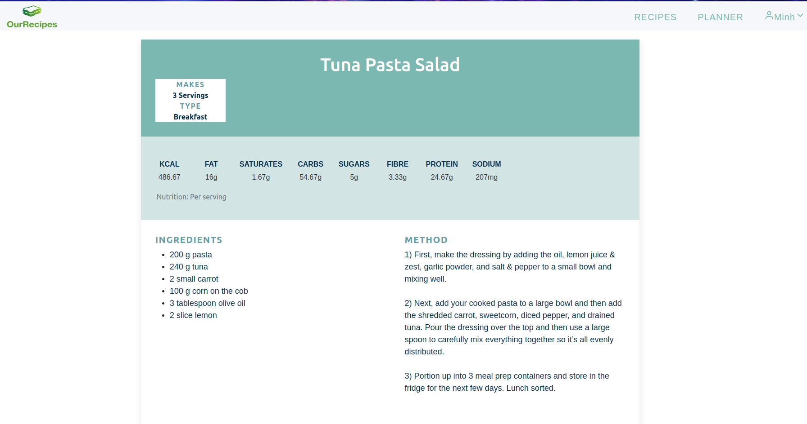
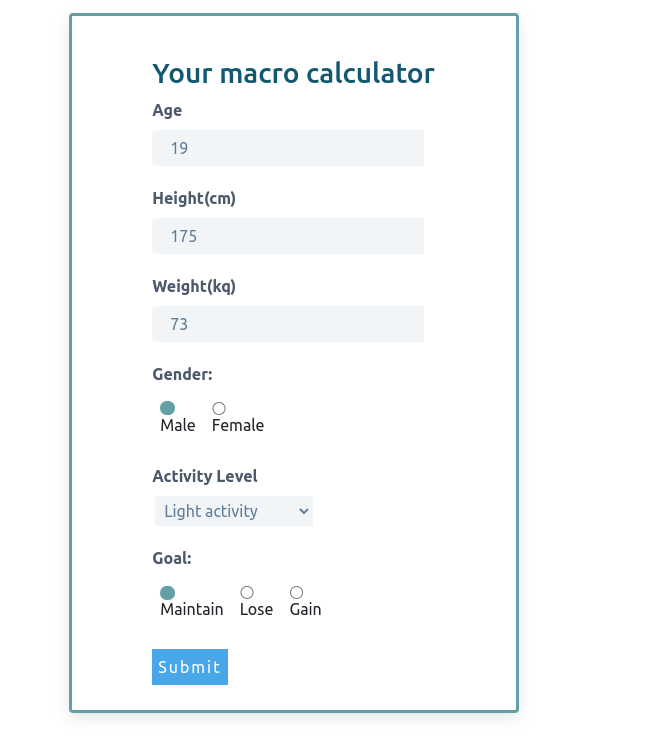
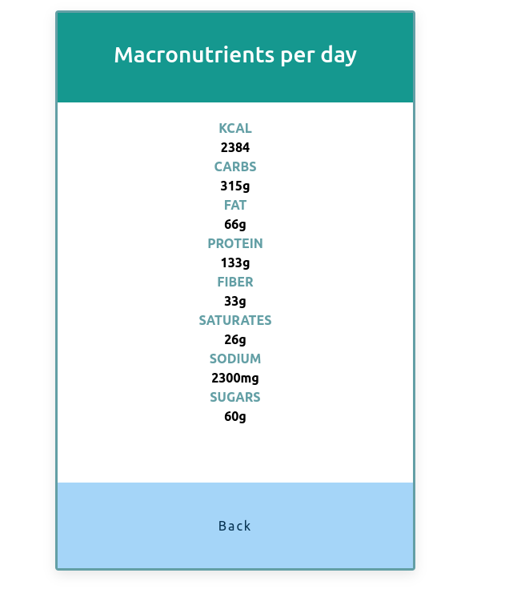
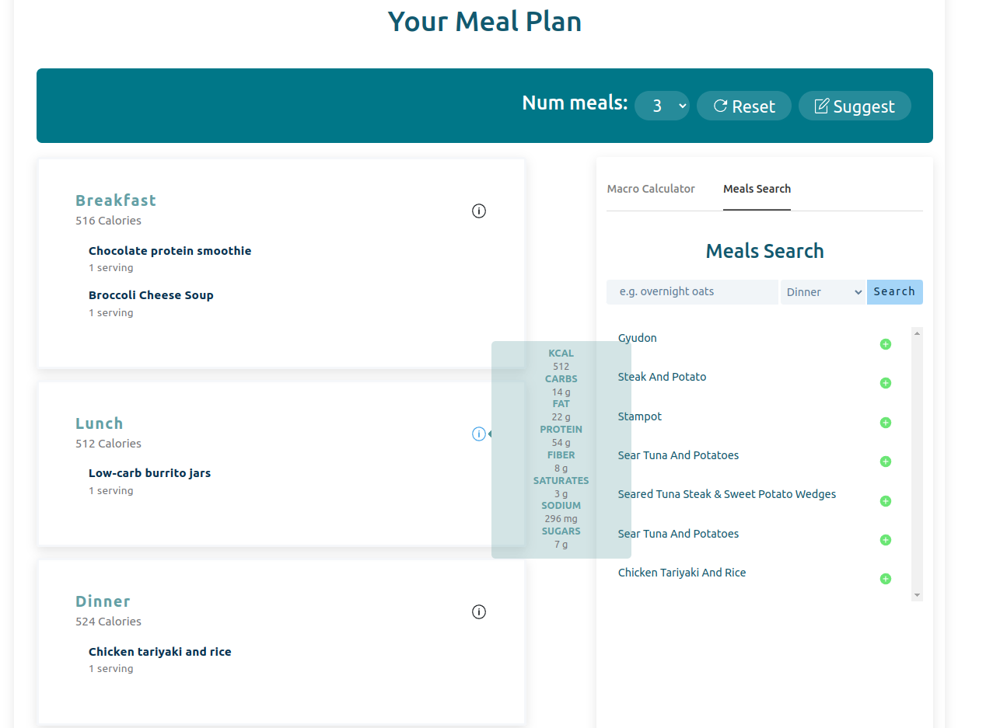

# ourRecipes

# Project overview

ourRecipe is a project that we build for our group of friends.
ourRecipe is a food website designed to encourage a healthy eating diet and regular exercising. 
With a focus on creating and sharing nutritious recipes, ourRecipe is the perfect platform for anyone who want to discover new and healthy meal ideas. 
The website features a unique scoring system that grades each recipe based on its cooking method and ingredients, making it easier for users to make informed choices about what they eat.
We also have a meal planner using a kNN model to suggest personalized meal plans based on user's macro, providing users with the nutrients they need for a healthy diet.

# Demo

https://monkfish-app-ctiss.ondigitalocean.app/

## Homepage



## Food Recipes




## Macro nutrition

|    Macro Nutrition Calculator    |    Macro Nutrition Result    |
| :------------------------------: | :--------------------------: |
|  |  |

## Recipe Recommendations



# Prerequisites
* [Python 3.9.15](https://www.python.org/downloads/)
* [pyenv](https://github.com/pyenv/pyenv#installation)
* [pipenv](https://github.com/pypa/pipenv)
* [npm](https://docs.npmjs.com/downloading-and-installing-node-js-and-npm)

# Installation

## Front-end

```
cd src/react_client
npm install
```

## Back-end

```
cd src/flask_server
pyenv install 3.9.15
pyenv local 3.9.15
pipenv install
```

# Deployment

## Deploy locally

```
cd src/react_client
npm start
```

```
cd src/flask_server
pipenv shell
gunicorn --bind 0.0.0.0:9696 main:app
```

## Deploy to Digital Ocean
The website is deployed automatically to Digital Ocean whenever there is a new push to the main branch.
